# 🤖 Rauf Alizada

<div align="center">

<picture>
  <source media="(prefers-color-scheme: dark)" srcset="social_preview_dark.PNG">
  <source media="(prefers-color-scheme: light)" srcset="social_preview_light.PNG">
  
</picture>

[](https://github.com/raufA1?tab=followers)
[](https://github.com/raufA1)
[](https://github.com/raufA1)

[](https://git.io/typing-svg)

</div>

---

## 🎯 About Me

I’m not just a developer who uses AI tools – **I’m an AI-native developer**. Every project I build, every line of code I write, and every problem I solve involves AI as my co-pilot.  
We are at the beginning of a fundamental shift in software development 🚀.

```typescript
interface AIFirstDeveloper {
  name: "Rauf Alizade";
  approach: "AI-Native Development";
  mission: "Democratizing AI through practical tools";
  workflow: "Human creativity + AI intelligence = Magic";
  currentFocus: "Building the future of AI-assisted development";
}
```

---

## 🛠️ My AI-Powered Tech Stack

<div align="center">

### **AI & Machine Learning**


### **Backend**


### **DevOps**


### **Frontend & Tools**


</div>

---

## 🌟 Featured Projects

### 🎯 Smart CLI – Enterprise AI CLI
AI-first CLI platform with **7 AI modes**, **multi-agent orchestration**, and **real-time cost optimization**.  
[Repo →](https://github.com/raufA1/smart-cli)

```bash
smart --mode architect "design a microservices architecture"
smart --mode code "refactor this Python class"
smart --mode orchestrator "coordinate multiple AI agents"
```

---

### 🎬 ClipFlow – AI Video Automation
Complete video automation pipeline: **Analyze → Captions → Music → Render → Publish → Analytics**.  
[Repo →](https://github.com/raufA1/clipflow)

```mermaid
%%{init: {
  "theme":"dark",
  "themeVariables":{"fontSize":"20px","lineColor":"#94a3b8"},
  "flowchart":{"nodeSpacing":80,"rankSpacing":90}
}}%%
graph LR
    A[📹 Upload] --> B[🧠 AI Analysis]
    B --> C[📝 Smart Captions]
    C --> D[🎵 Music Selection]
    D --> E[🎬 AI Render]
    E --> F[📊 Analytics]
```



---

### 🤖 LLM Family Pack v3 – Local AI Ecosystem
Manage AI models locally with simple CLI + automation.  
[Repo →](https://github.com/raufA1/llm-family-pack)

```bash
llm-claude "explain system design"
llm-gpt4 "write Python unit tests"
llm-local "run fine-tuned model"
```

---

## 📊 GitHub Analytics & Activity

<div align="center">


</div>

---

## 🧠 My AI-Native Development Process

```mermaid
%%{init: {
  "theme":"dark",
  "themeVariables":{"fontSize":"20px"},
  "flowchart":{"nodeSpacing":80,"rankSpacing":90}
}}%%
graph TD
    A[💡 Problem Identification] --> B[🤖 AI-Assisted Planning]
    B --> C[🏗️ AI Architecture Design]
    C --> D[💻 AI Pair Programming]
    D --> E[🧪 AI-Generated Testing]
    E --> F[📚 AI Documentation]
    F --> G[🚀 AI-Optimized Deployment]
    G --> H[📊 AI Performance Monitoring]
    H --> I[🔄 AI-Driven Optimization]
    I --> A
```

<div align="center">



</div>

---

## 🌐 Contact

<div align="center">

[](mailto:alizadarauf1@gmail.com)
[](https://github.com/raufA1)
[](mailto:alizadarauf1@gmail.com)

</div>

<div align="center">
