# 🤖 Rauf Alizada

<div align="center">

<!-- AI-First Developer Banner -->


<!-- Dark/Light theme alternativ -->
<!--
<picture>
  <source media="(prefers-color-scheme: dark)" srcset="https://raw.githubusercontent.com/raufA1/raufA1/main/assets/images/banner_dark.png">
  <source media="(prefers-color-scheme: light)" srcset="https://raw.githubusercontent.com/raufA1/raufA1/main/assets/images/banner_light.png">
  
</picture>
-->

<!-- Profile Badge-ləri -->
[](https://github.com/raufA1?tab=followers)
[](https://github.com/raufA1)
[](https://github.com/raufA1)
[](https://github.com/raufA1)

<!-- Animasiyalı Yazı -->
[](https://git.io/typing-svg)

</div>

---

## 🎯 About Me

I'm not just a developer who uses AI tools – **I'm an AI-native developer**. Every project I build, every line of code I write, and every problem I solve involves AI as my co-pilot.

**"Human creativity + AI intelligence = Magic"** ✨

<details>
<summary>📋 <strong>Developer Profile</strong></summary>

```typescript
interface AIFirstDeveloper {
  name: "Rauf Alizade";
  location: "Azerbaijan 🇦🇿";
  approach: "AI-Native Development";
  mission: "Democratizing AI through practical tools";
  workflow: "Human creativity + AI intelligence = Magic";
  currentFocus: "Building the future of AI-assisted development";
  
  contact: {
    email: "alizadarauf1@gmail.com",
    phone: "+994 50 710 07 01",
    github: "github.com/raufA1"
  };
  
  metrics: {
    workloadReduction: "60%+",
    speedIncrease: "3x",
    aiModes: 7,
    aiAgents: "20+",
    accuracy: "94%+"
  };
  
  languages: ["🇦🇿 Azerbaijani (Native)", "🇷🇺 Russian (Fluent)", "🇺🇸 English (Professional)"];
}
```

</details>

---

## 📊 Impact & Recognition

<div align="center">

<table>
<tr>
<td align="center" width="33%">

**📈 Performance Impact**

[](https://github.com/raufA1)

[](https://github.com/raufA1)

[](https://github.com/raufA1)

</td>
<td align="center" width="33%">

**🤖 AI Systems Built**

[](https://github.com/raufA1)

[](https://github.com/raufA1)

[](https://github.com/raufA1)

</td>
<td align="center" width="33%">

**🏆 Recognition**

[](https://github.com/raufA1)

[](https://github.com/raufA1)

[](https://github.com/raufA1)

</td>
</tr>
</table>

</div>

---

## 🛠️ AI-Powered Tech Stack

<div align="center">

### **🤖 AI & Machine Learning**


### **💻 Development & Architecture**


### **☁️ DevOps & Infrastructure**


### **🔐 Enterprise & Security**


</div>

---

## 🌟 Featured Projects

### 🎯 Smart CLI – Enterprise AI Platform
[](https://github.com/raufA1/smart-cli)
[](https://github.com/raufA1/smart-cli)
[](https://github.com/raufA1/smart-cli)
[](https://github.com/raufA1/smart-cli)

**AI-first CLI platform with 7 AI modes, multi-agent orchestration, and real-time cost optimization.**

<details>
<summary>🔍 <strong>Key Features & Achievements</strong></summary>

- 🤖 **7 Specialized AI Modes**: Smart, Code, Analysis, Architect, Learning, Fast, Orchestrator
- 🎯 **20+ AI Agents**: Intelligent task routing and coordination system  
- 🔐 **Enterprise Security**: SSO, RBAC, MFA, comprehensive audit logging
- 💰 **Cost Intelligence**: Real-time budget management and model optimization
- 🐳 **Production Ready**: Docker orchestration, Prometheus monitoring, Grafana dashboards
- 📊 **94%+ Accuracy**: Advanced request classification and intelligent routing
- ⚡ **Performance**: 60% workload reduction, 3x speed increase in development

**Technical Stack:**
- Backend: Python, FastAPI, SQLAlchemy
- AI: OpenAI, Anthropic Claude, OpenRouter
- Infrastructure: Docker, Kubernetes, Redis, PostgreSQL
- Monitoring: Prometheus, Grafana, Custom metrics
- Security: OAuth 2.0, RBAC, Encrypted credentials

</details>

```bash
smart --mode architect "design a microservices architecture"
smart --mode code "refactor this Python class"
smart --mode orchestrator "coordinate multiple AI agents"
```

---

### 🎬 ClipFlow – AI Video Automation Pipeline
[](https://github.com/raufA1/clipflow)
[](https://github.com/raufA1/clipflow)
[](https://github.com/raufA1/clipflow)

**Complete video automation pipeline: Analyze → Captions → Music → Render → Publish → Analytics.**

<details>
<summary>🎥 <strong>Pipeline & Features</strong></summary>

- 📹 **Complete Automation**: End-to-end video processing from analysis to multi-platform publishing
- 🌍 **Multi-language Captions**: AI-powered captions in Azerbaijani, English, Russian
- 🎯 **Smart Processing**: YOLOv8 integration for intelligent highlighting and object detection
- 🎵 **Intelligent Music**: Automatic music selection with copyright protection algorithms
- 📊 **Analytics Integration**: Performance tracking and optimal publishing time recommendations
- 🚀 **Production Scale**: Handles large-scale video processing workflows efficiently
- 🎨 **Auto Effects**: Smart cropping, pan effects, and visual enhancements

**Workflow:**
1. **AI Analysis**: Content understanding and scene detection
2. **Smart Captions**: Multi-language subtitle generation
3. **Music Selection**: Copyright-safe background music matching
4. **AI Rendering**: Automated editing with intelligent cuts
5. **Multi-Platform Publishing**: YouTube, Instagram, TikTok integration
6. **Performance Analytics**: Engagement tracking and optimization

```mermaid
%%{init: {
  "theme":"dark",
  "themeVariables":{"fontSize":"14px","lineColor":"#94a3b8"},
  "flowchart":{"nodeSpacing":50,"rankSpacing":60}
}}%%
graph LR
    A[📹 Upload] --> B[🧠 AI Analysis]
    B --> C[📝 Smart Captions]
    C --> D[🎵 Music Selection]
    D --> E[🎬 AI Render]
    E --> F[📊 Analytics]
```

</details>

<div align="center">



</div>

---

### 🧠 LLM Family Pack – Local AI Ecosystem
[](https://github.com/raufA1/llm-family-pack)
[](https://github.com/raufA1/llm-family-pack)
[](https://github.com/raufA1/llm-family-pack)

**Manage AI models locally with simple CLI + automation.**

<details>
<summary>🧠 <strong>AI Management Capabilities</strong></summary>

- 🔄 **Multi-Model Support**: Unified interface for Claude, GPT-4, Gemini, and local models
- 🏠 **Local Deployment**: Complete local LLM hosting and management infrastructure
- 🔗 **API Standardization**: Consistent interface across different AI providers
- ⚡ **Intelligent Fallbacks**: Automatic model switching for optimal performance
- 📊 **Usage Analytics**: Comprehensive monitoring and cost tracking systems
- 🛡️ **Privacy First**: All data stays local, no external dependencies required
- 🎛️ **Easy Management**: Simple CLI commands for complex AI operations

**Supported Models:**
- Cloud: OpenAI GPT-4, Anthropic Claude, Google Gemini
- Local: Llama, Mistral, CodeLlama, Custom fine-tuned models
- APIs: OpenRouter, LiteLLM, Custom endpoints

</details>

```bash
llm-claude "explain system design"
llm-gpt4 "write Python unit tests"
llm-local "run fine-tuned model"
```

---

## 📈 GitHub Analytics & Activity

<div align="center">


[](https://github.com/raufA1)

</div>

---

## 🧠 AI-Native Development Process

**Complete AI-powered development lifecycle with intelligent automation.**

```mermaid
%%{init: {
  "theme":"dark",
  "themeVariables":{"fontSize":"12px","lineColor":"#94a3b8"},
  "flowchart":{"nodeSpacing":30,"rankSpacing":40}
}}%%
graph LR
    A[💡 Ideation] --> B[🏗️ Architecture]
    B --> C[💻 Development]
    C --> D[🧪 Testing]
    D --> E[🚀 Deploy]
    E --> F[📊 Monitor]
```

<div align="center">



</div>

---

## 📞 Connect & Collaborate

<div align="center">

| 📧 Email | 💻 GitHub | 📱 Phone | 📄 CV |
|:--------:|:---------:|:--------:|:-----:|
| [](mailto:alizadarauf1@gmail.com) | [](https://github.com/raufA1) | [](tel:+994507100701) | [](docs/CV-EN.md) |

</div>

**Open for AI collaboration, consultation, and innovative projects!** 🚀

---

## 💡 Current Focus & Future Vision

<div align="center">

### **🎯 2024-2025 Roadmap**

</div>

- 🚀 **Scaling Smart CLI** with advanced enterprise features and multi-tenant support
- 🎬 **Enhancing Clipflow** with real-time video processing and advanced AI analytics  
- 🧠 **Local AI Research** optimizing local LLM deployment and fine-tuning workflows
- 🔧 **Next-Gen Tools** building revolutionary AI-assisted development platforms
- 🌍 **AI Democratization** making advanced AI tools accessible to all developers worldwide

---

<div align="center">

### **Always in Dev Mode...** 👨‍💻

*"Building the future of AI-assisted development, one commit at a time"* 🚀

[](https://github.com/raufA1)
