# 🤖 Rauf Alizade

<div align="center">


[](https://github.com/raufA1?tab=followers)
[](https://github.com/raufA1)
[](https://github.com/raufA1)

[](https://git.io/typing-svg)

</div>

## 🎯 About Me

I’m not just a developer who uses AI tools – **I’m an AI-native developer**. Every project I build, every line of code I write, and every problem I solve involves AI as my co-pilot. I believe we’re in the early days of a fundamental shift in how software gets built.

```typescript
interface AIFirstDeveloper {
  name: "Rauf Alizade";
  approach: "AI-Native Development";
  mission: "Democratizing AI through practical tools";
  workflow: "Human creativity + AI intelligence = Magic";
  currentFocus: "Building the future of AI-assisted development";
}

const myPhilosophy = {
  codeGeneration: "AI writes the boilerplate, I focus on architecture",
  problemSolving: "AI helps explore solution spaces I'd never consider", 
  learning: "AI accelerates my understanding of new technologies",
  productivity: "What used to take days, now takes hours with AI",
  future: "Every developer will have an AI pair programmer"
};
```

## 🛠️ My AI-Powered Tech Stack

<div align="center">

### **AI & Machine Learning**


### **Backend Development**


### **Infrastructure & DevOps**


### **Frontend & Tools**


</div>

## 🌟 Featured AI-Built Projects

### 🎯 [Smart CLI](https://github.com/raufA1/smart-cli) - Revolutionary AI CLI Platform

<div align="center">

[](https://github.com/raufA1/smart-cli/actions)
[](https://codecov.io/gh/raufA1/smart-cli)
[](https://opensource.org/licenses/MIT)
[](https://python.org)

</div>

My flagship project - an **enterprise-grade AI orchestration platform** designed, architected, and built entirely with AI assistance. This isn’t just a CLI tool; it’s a complete AI development ecosystem.

```bash
# 7 Specialized AI Modes - Each optimized for specific tasks
smart --mode architect "design a microservices architecture for e-commerce"
smart --mode code "refactor this Python class for better performance"  
smart --mode orchestrator "coordinate multiple AI agents for complex deployment"
smart --mode learning "explain quantum computing with interactive examples"
```

**🧠 AI-First Architecture:**

- **Enhanced Mode System** → 7 specialized AI personalities for different development tasks
- **Multi-Agent Orchestra** → 20+ AI agents working collaboratively on complex problems
- **Intelligent Context Management** → AI maintains conversation context across sessions and modes
- **Smart Budget Optimization** → AI automatically optimizes API costs and token usage
- **Real-time Intelligence** → AI-powered analytics, insights, and recommendations

**🚀 Enterprise Features Built with AI:**

- Multi-LLM routing with intelligent model selection
- Automated Git workflows and CI/CD integration
- Real-time cost tracking with AI-powered optimization
- Enterprise security (SSO, RBAC, audit logging)
- Production monitoring with Prometheus and Grafana

### 🎬 [ClipFlow](https://github.com/raufA1/clipflow) - AI Video Automation Platform

<div align="center">

[](https://python.org)
[](https://flask.palletsprojects.com)
[](https://github.com/raufA1/clipflow)

</div>

Complete video content automation pipeline built entirely with AI assistance - from initial concept to deployment strategy.


**🎯 Perfect for:** YouTube Shorts • TikTok • Instagram Reels • Content Creators

**🤖 AI-Generated Features:**

- Intelligent content analysis with mood detection
- Auto-generated captions with emotion and timing optimization
- AI-powered music selection based on video content and target audience
- Automated thumbnail generation with A/B testing capabilities
- Performance analytics with AI-driven insights and recommendations

### 🤖 [LLM Family Pack v3](https://github.com/raufA1/llm-family-pack) - Personal AI Ecosystem

<div align="center">

[](https://www.gnu.org/software/bash/)
[](https://python.org)
[](https://systemd.io/)

</div>

My personal AI model management system - designed, optimized, and automated entirely with AI assistance.

```bash
# Seamless AI model switching and management
llm-claude "architect a distributed system with microservices"
llm-gpt4 "write comprehensive unit tests for this Python class"
llm-local "run inference on my custom fine-tuned model"
llm-multi "compare responses across different models for this prompt"
```

**🧠 AI-Enhanced Features:**

- Intelligent model routing based on task complexity and requirements
- Automatic cost optimization across multiple AI providers
- AI-generated performance benchmarks and model comparisons
- Smart caching with AI-predicted usage patterns
- Zero-downtime model switching with intelligent fallbacks

## 📊 GitHub Analytics & Activity

<div align="center">


</div>

## 🧠 My AI-Native Development Process

```mermaid
graph TD
    A[💡 Problem Identification] --> B[🤖 AI-Assisted Planning]
    B --> C[🏗️ AI Architecture Design]
    C --> D[💻 AI Pair Programming]
    D --> E[🧪 AI-Generated Testing]
    E --> F[📚 AI Documentation]
    F --> G[🚀 AI-Optimized Deployment]
    G --> H[📊 AI Performance Monitoring]
    H --> I[🔄 AI-Driven Optimization]
    I --> A
    
    style A fill:#3B82F6,color:#fff
    style B fill:#10B981,color:#fff
    style C fill:#8B5CF6,color:#fff
    style D fill:#F59E0B,color:#fff
    style E fill:#EF4444,color:#fff
    style F fill:#06B6D4,color:#fff
    style G fill:#84CC16,color:#fff
    style H fill:#EC4899,color:#fff
    style I fill:#F97316,color:#fff
```

<div align="center">



</div>

## 💡 AI-First Development Philosophy

<div align="center">

|🎯 **AI Planning**                                        |💻 **AI Coding**                                         |🧪 **AI Testing**                                         |📊 **AI Analytics**                                        |
|:-------------------------------------------------------:|:------------------------------------------------------:|:-------------------------------------------------------:|:--------------------------------------------------------:|
|Claude breaks down complex problems into manageable tasks|Continuous pair programming with GPT-4 and Claude       |AI generates comprehensive test suites I never thought of|AI provides insights from user behavior and system metrics|
|AI suggests optimal architectures and design patterns    |AI writes boilerplate while I focus on business logic   |Multiple AI models review code for bugs and optimizations|AI predicts performance bottlenecks before they happen    |
|AI estimates timelines and identifies potential blockers |AI refactors code for better performance and readability|AI creates edge cases and stress tests automatically     |AI recommends features based on usage patterns            |

</div>

**My Daily AI Workflow:**

- 🌅 **Morning Planning** → AI helps prioritize tasks and plan architecture
- 💻 **Development** → Continuous AI pair programming and code reviews
- 🧪 **Testing** → AI generates test cases and identifies edge cases
- 📚 **Documentation** → AI writes and maintains comprehensive docs
- 🚀 **Deployment** → AI optimizes deployment strategies and monitors performance
- 📊 **Analysis** → AI analyzes user feedback and system metrics for improvements

## 🎊 Current AI Experiments & Research

<div align="center">

|🧪 **AI Research**                       |🛠️ **Tool Development**                      |🌍 **Community**                                       |⚡ **Innovation**                                     |
|:--------------------------------------:|:------------------------------------------:|:----------------------------------------------------:|:---------------------------------------------------:|
|Multi-agent orchestration patterns      |Building next-gen AI-first development tools|Sharing AI workflows and advanced prompting techniques|Exploring the boundaries of AI-human collaboration   |
|Advanced prompt engineering strategies  |Creating seamless AI developer experiences  |Contributing to AI open source ecosystem              |Early adoption of cutting-edge AI technologies       |
|AI-powered code generation methodologies|Automating complex development workflows    |Teaching AI integration best practices                |Building the infrastructure for AI-native development|

</div>

## 🌐 Let’s Build the AI-Powered Future Together

<div align="center">

[](mailto:alizadarauf1@gmail.com)
[](https://github.com/raufA1)
[](mailto:alizadarauf1@gmail.com)

**Let’s discuss:** AI-first development strategies • Multi-agent system architectures • Advanced automation workflows • AI tool integration patterns

</div>

<div align="center">

### 🤖 *“I don’t just use AI tools – I live in an AI-native development ecosystem where every decision is enhanced by artificial intelligence”*

**Building the future where every developer has an intelligent AI pair programmer** 🚀


</div>

<div align="center">
<sub>🤖 This README was entirely crafted with AI assistance - from structure and content to styling and optimization. It represents the future of AI-native development documentation.</sub>
</div>