# 🤖 Rauf Alizade

> **AI-First Developer** • Building intelligent automation tools with AI assistance at every step

<div align="center">

[](https://git.io/typing-svg)

[](https://github.com/raufA1?tab=followers)
[](https://github.com/raufA1)

</div>

-----

## 🎯 My AI-First Approach

I don’t just use AI tools – **I live and breathe AI development**. Every line of code, every architectural decision, every problem I solve involves AI assistance. I’m building the future where human creativity and artificial intelligence work seamlessly together.

```python
class AIFirstDeveloper:
    def __init__(self):
        self.name = "Rauf Alizade"
        self.philosophy = "AI is not just a tool, it's my coding partner"
        self.workflow = self.always_ai_assisted()
    
    def always_ai_assisted(self):
        return {
            "planning": "AI helps design architecture",
            "coding": "AI pair programming for everything", 
            "debugging": "AI-powered error analysis",
            "documentation": "AI generates and reviews docs",
            "testing": "AI creates comprehensive test suites",
            "deployment": "AI monitors and optimizes"
        }
```

-----

## 🛠️ Technology Stack

<div align="center">

|**AI & Machine Learning**|**Backend Development**|**Infrastructure & DevOps**|**Frontend & Tools**|
|:-----------------------:|:---------------------:|:-------------------------:|:------------------:|
|OpenAI GPT-4 & Claude    |Python & FastAPI       |Docker & Kubernetes        |React & TypeScript  |
|LiteLLM & OpenRouter     |Flask & SQLAlchemy     |PostgreSQL & Redis         |Next.js & Tailwind  |
|Multi-Agent Systems      |AsyncIO & Typer        |GitHub Actions CI/CD       |Rich CLI & Plotly   |
|Anthropic Claude API     |Pydantic & Alembic     |Prometheus & Grafana       |Streamlit & Gradio  |

</div>

-----

## 🌟 Featured AI-Powered Projects

### 🎯 [Smart CLI](https://github.com/raufA1/smart-cli)

**Revolutionary AI-Enhanced Command Line Platform**

[](https://github.com/raufA1/smart-cli/actions)
[](https://codecov.io/gh/raufA1/smart-cli)
[](https://opensource.org/licenses/MIT)

My flagship project that embodies AI-first development. This isn’t just a CLI tool – it’s an **AI orchestration platform** built entirely with AI assistance.

```bash
# 7 Specialized AI Modes - Each built with AI pair programming
smart --mode architect "design microservices for e-commerce"
smart --mode code "refactor this Python class for better performance"  
smart --mode orchestrator "coordinate multiple AI agents for deployment"
smart --mode learning "explain advanced algorithms step by step"
```

**🚀 AI-First Features:**

- **Enhanced Mode System** - 7 specialized AI personalities for different tasks
- **Multi-Agent Orchestra** - 20+ AI agents working collaboratively
- **Intelligent Context** - AI manages conversation context across sessions
- **Smart Budget Control** - AI optimizes API costs automatically
- **Real-time Analytics** - AI-powered usage insights and recommendations

**Built entirely with AI assistance using:** Python • FastAPI • Typer • Rich • Docker • Redis • PostgreSQL

-----

### 🎬 [ClipFlow](https://github.com/raufA1/clipflow)

**AI-Powered Video Content Automation Pipeline**

[](https://python.org)
[](https://github.com/raufA1/clipflow)

Complete video automation built with AI from concept to deployment. AI handled everything from architecture design to API integration.

```
AI Video Pipeline: Upload → Analyze → Caption → Music → Render → Publish
                     ↓        ↓        ↓       ↓       ↓        ↓
                   OpenAI   Claude   Whisper  AI-Gen  FFmpeg  APIs
```

**Perfect for:** YouTube Shorts • TikTok • Instagram Reels • Content Creators

**AI-Generated Features:**

- Automatic content analysis and optimization suggestions
- AI-powered caption generation with emotion detection
- Smart music selection based on video mood
- Automated thumbnail generation with A/B testing
- Performance analytics with AI insights

-----

### 🤖 [LLM Family Pack v3](https://github.com/raufA1/llm-family-pack)

**Personal AI Model Management Ecosystem**

My solution for managing multiple AI models locally. Designed, coded, and optimized entirely with AI assistance.

```bash
# Switch between AI models seamlessly
llm-claude "architect a distributed system"
llm-gpt4 "write comprehensive unit tests"
llm-local "run inference on custom model"
llm-multi "compare responses across models"
```

**AI-Enhanced Features:**

- Smart model routing based on task type
- Automatic cost optimization across providers
- AI-generated model performance benchmarks
- Intelligent caching with AI-predicted patterns

-----

## 📊 GitHub Analytics

<div align="center">


</div>

-----

## 🧠 AI-Powered Development Workflow

```mermaid
graph TD
    A[💡 Idea] --> B[🤖 AI Planning]
    B --> C[🏗️ AI Architecture]
    C --> D[💻 AI Pair Coding]
    D --> E[🧪 AI Testing]
    E --> F[📚 AI Documentation]
    F --> G[🚀 AI Deployment]
    G --> H[📊 AI Monitoring]
    H --> A
    
    style A fill:#3B82F6,color:#fff
    style B fill:#10B981,color:#fff
    style C fill:#8B5CF6,color:#fff
    style D fill:#F59E0B,color:#fff
    style E fill:#EF4444,color:#fff
    style F fill:#06B6D4,color:#fff
    style G fill:#84CC16,color:#fff
    style H fill:#EC4899,color:#fff
```

<div align="center">



</div>

-----

## 💡 My AI-First Philosophy

**Every Project Starts with AI:**

- 🎯 **AI Planning** - Claude helps me break down complex problems
- 🏗️ **AI Architecture** - GPT-4 designs system architecture
- 💻 **AI Coding** - Continuous pair programming with AI
- 🔍 **AI Code Review** - Multiple AI models review my code
- 📝 **AI Documentation** - AI generates comprehensive docs
- 🧪 **AI Testing** - AI creates test cases I never thought of
- 🚀 **AI Deployment** - AI optimizes deployment strategies
- 📊 **AI Analytics** - AI provides insights from user data

-----

## 🎊 Current AI Experiments

<div align="center">

|🧪 **AI Research**                    |🛠️ **AI Tools**                            |🌍 **AI Community**                     |⚡ **AI Innovation**                             |
|:-----------------------------------:|:----------------------------------------:|:-------------------------------------:|:----------------------------------------------:|
|Multi-agent orchestration patterns   |Building AI-first development tools       |Sharing AI workflows and prompts       |Pushing the boundaries of AI-human collaboration|
|AI-powered code generation strategies|Creating seamless AI developer experiences|Contributing to AI open source projects|Exploring emerging AI technologies daily        |
|Prompt engineering for complex tasks |Automating everything with AI assistance  |Teaching AI integration best practices |Building the future of AI-assisted development  |

</div>

-----

## 🌐 Connect & Collaborate on AI Projects

<div align="center">

[](mailto:alizadarauf1@gmail.com)
[](https://github.com/raufA1)
[](mailto:alizadarauf1@gmail.com)

**Let’s discuss:** AI-first development • Multi-agent systems • Automation workflows • AI tool integration

</div>

-----

<div align="center">

### 🤖 *“I don’t just use AI tools – I live in an AI-powered development ecosystem”*

**Building the future where every developer has an AI pair programmer** • **One intelligent tool at a time** 🚀


</div>

-----

<div align="center">
<sub>🤖 This README was crafted with AI assistance, reviewed by AI, and optimized by AI – because that's how I build everything!</sub>
</div>