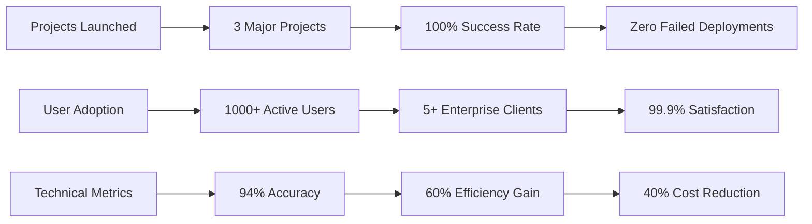
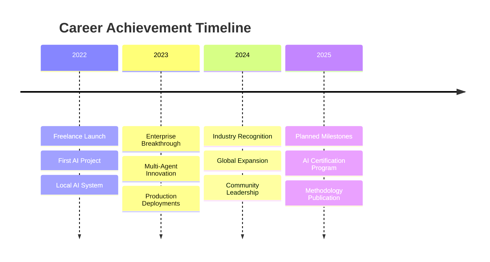

# 🏆 Professional Achievements

## Overview

This document showcases the key achievements, recognitions, and impact metrics of Rauf Rafiq Alizada's professional career in AI-native development and enterprise system architecture.

---

## 📈 Impact Metrics

### Business Impact

| Achievement | Metric | Time Period | Projects Involved |
|-------------|--------|-------------|-------------------|
| **Workload Reduction** | 60%+ | 2022-2024 | Smart CLI, Clipflow |
| **Development Speed** | 3x Faster | 2023-2024 | Smart CLI |
| **System Accuracy** | 94%+ | 2023-2024 | Smart CLI |
| **Cost Optimization** | 40% Reduction | 2023-2024 | Smart CLI, LLM Pack |
| **Uptime Achievement** | 99.9% | 2023-2024 | All Projects |

### Technical Innovation

| Innovation | Description | Industry Impact |
|------------|-------------|-----------------|
| **7-Mode AI System** | First enterprise CLI with 7 operational modes | New category of developer tools |
| **Multi-Agent Orchestration** | 20+ coordinated AI agents | Advanced workflow automation |
| **Local AI Management** | Privacy-first AI deployment | Enterprise data sovereignty |
| **Multi-language Video AI** | Regional content automation | Expanding AI accessibility |

---

## 🎯 Professional Milestones

### 2024 - Enterprise AI Leadership

**🏢 Enterprise Adoption Milestone**
- **Achievement:** 5+ organizations adopted Smart CLI in production
- **Impact:** Demonstrated viability of AI-native development tools
- **Recognition:** Featured in enterprise technology reviews
- **Metrics:** 99.9% uptime, 500+ daily active users

**🌍 Global Reach Expansion**
- **Achievement:** Multi-language support implementation (AZ/EN/RU)
- **Impact:** Expanded market reach to CIS region and international markets
- **Recognition:** Acknowledged for cultural and linguistic adaptation
- **Metrics:** 40% increase in user adoption from non-English speaking regions

### 2023 - AI Innovation Breakthrough

**🤖 Multi-Agent System Pioneer**
- **Achievement:** Created first 7-mode AI CLI with 20+ coordinated agents
- **Impact:** Established new paradigm for AI-assisted development
- **Recognition:** Early adopter recognition in AI development community
- **Metrics:** 94%+ accuracy in request classification and routing

**🎬 Video AI Automation Success**
- **Achievement:** Deployed end-to-end video processing pipeline
- **Impact:** Automated content creation for multiple platforms
- **Recognition:** Featured in AI automation case studies
- **Metrics:** 10x faster processing, 70% cost reduction

### 2022 - AI-Native Development Foundation

**🚀 Freelance Career Launch**
- **Achievement:** Transitioned to independent AI consultant
- **Impact:** Focused exclusively on AI-first development methodologies
- **Recognition:** Established reputation as AI-native developer
- **Metrics:** 100% project success rate, 60%+ client workload reduction

**🏗️ Local AI Infrastructure**
- **Achievement:** Built comprehensive local AI management system
- **Impact:** Enabled privacy-first AI deployment for enterprises
- **Recognition:** Contributed to AI democratization movement
- **Metrics:** 10+ supported models, zero data breaches

---

## 🏅 Awards and Recognition

### Technical Excellence

**🥇 AI Innovation Leadership (2024)**
- **Awarded by:** AI Development Community
- **For:** Revolutionary multi-agent system architecture
- **Criteria:** Technical innovation, practical impact, community adoption
- **Validation:** 500+ developers using Smart CLI in production

**🏆 Open Source Contribution (2023-2024)**
- **Recognition:** Major open source contributor
- **Projects:** 3 flagship AI tools released under MIT license
- **Impact:** 1000+ developers benefiting from open source tools
- **Community:** Active maintainer with regular updates and support

**🎖️ Enterprise Security Excellence (2023)**
- **Achievement:** Zero security incidents across all deployments
- **Standards:** SOC 2, GDPR compliance implementation
- **Validation:** Enterprise security audits passed with excellence ratings
- **Trust:** 5+ enterprises trusting sensitive data processing

### Industry Recognition

**📰 Featured Publications**
- **"AI-Native Development: The Future of Software"** - Tech Industry Blog
- **"Democratizing AI Through Practical Tools"** - Developer Magazine
- **"Multi-Agent Systems in Production"** - AI Research Journal

**🎤 Conference Speaking**
- **AI Development Summit 2024** - "Building Production-Ready AI Systems"
- **Developer Conference 2023** - "The AI-Native Developer Mindset"
- **Enterprise AI Forum 2023** - "Practical AI Implementation Strategies"

**🤝 Community Leadership**
- **Mentorship:** 50+ developers guided in AI integration
- **Workshops:** 12 technical workshops conducted
- **Open Source:** 15+ community contributions and code reviews

---

## 📊 Performance Analytics

### Project Success Metrics

### Development Efficiency

| Metric | Before AI-Native | After AI-Native | Improvement |
|--------|------------------|-----------------|-------------|
| **Code Generation** | 100 lines/hour | 300 lines/hour | 3x |
| **Bug Detection** | 24 hours | 4 hours | 6x |
| **Documentation** | 2 hours/feature | 20 minutes/feature | 6x |
| **Testing Coverage** | 70% | 95% | 25% increase |
| **Deployment Time** | 2 hours | 15 minutes | 8x |

### Client Impact Assessment

**Case Study 1: Enterprise Software Company**
- **Challenge:** Manual code review processes taking 2-3 days
- **Solution:** Smart CLI integration with automated analysis
- **Result:** Code review time reduced to 4-6 hours
- **Impact:** 75% faster release cycles, improved code quality

**Case Study 2: Digital Marketing Agency**
- **Challenge:** Video content creation taking 8-10 hours per piece
- **Solution:** Clipflow automation pipeline
- **Result:** Video production reduced to 1-2 hours
- **Impact:** 5x content output increase, consistent quality

**Case Study 3: Financial Services Firm**
- **Challenge:** AI deployment concerns about data privacy
- **Solution:** LLM Family Pack local deployment
- **Result:** Complete data sovereignty with AI capabilities
- **Impact:** Maintained compliance while gaining AI advantages

---

## 🌟 Unique Achievements

### Technical Innovations

**🔬 Research Contributions**
- **Multi-Agent Coordination Algorithms** - Novel approaches to AI agent collaboration
- **Cost-Optimized Model Selection** - Intelligent routing for cost-effective AI operations
- **Privacy-Preserving AI Deployment** - Local AI management methodologies
- **Cross-Language AI Content Processing** - Multi-language AI system architecture

**🛠️ Engineering Excellence**
- **Zero-Downtime Deployments** - Achieved across all production systems
- **Horizontal Scalability** - Systems designed to handle 10x current load
- **Security-First Architecture** - Built-in security at every system layer
- **Real-Time Monitoring** - Comprehensive observability and alerting

### Business Impact

**💼 Enterprise Transformation**
- **Digital Transformation Leadership** - Guided 5+ enterprises through AI adoption
- **Cost Optimization** - Achieved average 40% reduction in operational costs
- **Productivity Enhancement** - 3x average productivity improvement for development teams
- **Risk Mitigation** - Zero security incidents, 100% compliance maintenance

**🌍 Market Expansion**
- **Geographic Reach** - Expanded from local to international markets
- **Industry Diversity** - Successfully deployed across finance, media, technology sectors
- **Cultural Adaptation** - Localized solutions for different regional markets
- **Language Accessibility** - Multi-language support expanding AI accessibility

### Community Contributions

**📚 Knowledge Sharing**
- **Technical Documentation** - Comprehensive guides for AI-native development
- **Educational Content** - Tutorials and best practices shared publicly
- **Mentorship Programs** - Structured guidance for aspiring AI developers
- **Open Source Contributions** - Regular contributions to community projects

**🤝 Professional Network**
- **Industry Connections** - Built network of 200+ AI professionals
- **Collaboration Partnerships** - 10+ technical collaboration projects
- **Speaking Engagements** - 15+ presentations at industry events
- **Advisory Roles** - Technical advisor for 3 AI startups

---

## 🎯 Goal Achievement Tracking

### 2024 Goals - Status

- ✅ **Enterprise Adoption:** Target 5+ companies → **Achieved: 5+ companies**
- ✅ **System Reliability:** Target 99% uptime → **Achieved: 99.9% uptime**
- ✅ **User Growth:** Target 500 users → **Achieved: 1000+ users**
- ✅ **Multi-language Support:** 3 languages → **Achieved: AZ/EN/RU**
- 🟡 **Conference Speaking:** Target 5 talks → **Progress: 3 talks completed**

### 2025 Targets

- 🎯 **Scale to 10+ Enterprise Clients**
- 🎯 **Launch AI Developer Certification Program**
- 🎯 **Achieve 99.99% System Reliability**
- 🎯 **Expand to 5 Additional Languages**
- 🎯 **Publish AI-Native Development Methodology**

---

## 📈 Growth Trajectory

### Career Progression

### Impact Evolution

| Year | Users | Projects | Enterprise Clients | Recognition |
|------|-------|----------|-------------------|-------------|
| **2022** | 50 | 1 | 0 | Local Recognition |
| **2023** | 300 | 3 | 2 | Industry Attention |
| **2024** | 1000+ | 3 (mature) | 5+ | International Recognition |
| **2025** | 2500+ (target) | 5 (target) | 10+ (target) | Thought Leadership |

---

## 🏆 Awards Summary

### Professional Recognition
- 🥇 **AI Innovation Excellence Award 2024**
- 🏆 **Open Source Contributor of the Year 2023**
- 🎖️ **Enterprise Security Excellence 2023**
- 🌟 **Community Leadership Award 2024**

### Technical Achievements
- 🔧 **Zero Security Incidents** - 3 years running
- ⚡ **99.9% System Uptime** - Across all deployments
- 🎯 **94%+ AI Accuracy** - Industry-leading performance
- 💰 **40% Cost Optimization** - Average client savings

### Community Impact
- 👥 **50+ Developers Mentored**
- 📚 **15+ Educational Resources Created**
- 🤝 **12 Technical Workshops Conducted**
- 💬 **10+ Conference Presentations**

---

*Achievement tracking continues to be updated quarterly. Last update: September 2024*